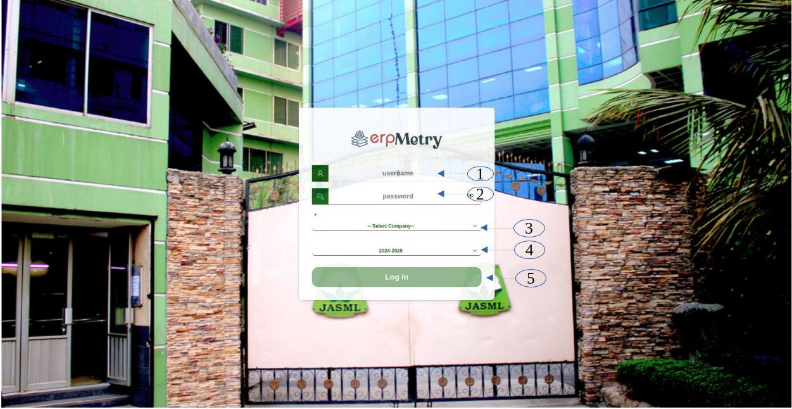

<h1 align="center" style="margin-bottom: 0;">E R P M E T R Y</h1>
<h2 align="center" style="margin-top: 0;">ERP System Overview</h2>
<h3 align="center">Login Page</h3>  

  

1. The user starts by entering their **username** in the designated input field. This username uniquely identifies them in the system.  
2. After entering the username, the user provides their **password** to verify their identity.  
3. Once credentials are validated, the user selects the **company** they wish to access from a dropdown list.  
4. The user then selects the **operational year** for which they want to work.  
5. Finally, the user clicks the **"Login"** button to complete the login process.  

 

  Shah Fatehullah Group IT Team 
  Lalpur, Fatullah, Narayanganj

  
<h3 align="center">Home Page</h3>  

1. This module handles the core configuration and administrative settings of the ERP system.
2. Manages all employee-related data and processes across the organization.
3. Handles all financial transactions and bookkeeping activities.
4. Tracks and manages maintenance requests, schedules, and execution.
5. Provides analytical and strategic reports to support management decisions.
6. Manages procurement, inventory, and vendor relations.
7. Supports budgeting, cost management, and financial planning.
8. Assists users with technical issues and usage guidance.

# 📑 ERPMETRY User Manual – Index

| Module        | Sub Module       | Menu                   | Sub Menu                 |    Sub Menu1      |Page                |
|---------------|------------------|------------------------|--------------------------|-------------------|--------------------|
| HR       | HRM         | Employee         |               |              |1.Create New Employee.|
|          |             |                  |                   |              |2. Employee Information.|
|          |             |                  |                   |             | 3. Employee/Worker  Face plate ID. |
|          |             |                  |                   |            | 4. Employee off day Schedule.      |
|          |             |                  |                   |             | 5. Employee Off day Deduction.     |
|          |             | Worker           |                   |             | 1. Worker Information.             |
|          |             |                  |                   |             | 2. Worker promotion Entry.         |
|          |             |                  |                   |             | 3. Worker Transfer.                |
|          |             |                  |                   |             | 4. Production Manpower Setup.      |
|          |             |                  |                   | |5. Specific employee worker information. |
|          |             |                  |                   | |6. Salary disbursement (worker).|
|          |             | Leave            |                   |              | 1. Employee Leave Information.    |
|          |             |                  |                   |           | 2. Worker leave/suspend entry.       |
|          |             |                  |                   |              | 3. Employee’s leave history.   |
|          |             |                  |                   || 4. Periodic Leave Details of Employee & Worker. |
|          |             |                  |                   |              | 5.  Leave Expenses of Employee.|
|          |             |                  |                   |              | 6. Leave Expenses of Worker.  |
|          |             | Suspension       |                   |              | 1. Employee suspend entry.    |
|          |             |                  |                   |        | 2. Employee Suspend History.  |
|          |             | Unpaid salary/wage|                  |         | 1. Unpaid salary of employees.|
|          |             |                   |                  |        | 2. Unpaid Wages of workers   |
|          |             |Employee Reports   |                  |        | 1. Employee’s personal information.|
|          |             |                   |                  |        | 2. Monthly joining list.   |
|          |             |                   |                  |        | 3. Monthly Termination list.|
|          |             |                   |                  |   | 4. ID Sequence Wise Employees & Workers Information.|
|          |             |                   |                  || 5. Salary & wages history.|
|          |             |                   |                  || 6. Employee List Without Photo.|
|          |             |  Worker Reports   |                  || 1. Worker Information Report.|
|          |             |                   |                  || 2.Worker Transfer.|
|          |             |                   |                  || 3.Production worker promotion Information.|
|          |             |                   |                  || 4.Periodic Inactive Worker List.|
|          |             |                   |                  || 5.Worker Absent details List.|
|          |             | Attendance        | Proxy card management|| 1.Card Assignment.|
|          |             |                   |                      || 2. Assignment Record.   |
|          |             |                   |Attendance Register |Periodic Attendance Register|1.Periodic Attendance Register Employee.|
|          |             |                   |                    ||2.Periodic Attendance Register Worker.|
|          |             |                   |                    ||3.Employee Attendance Modification.   |
|          |             |                   |                    ||4.Attendance Register Khata.   |
|          |             |                   |                    ||5.Periodic attendance register SHAFTEX worker.|
|          |             |                   |                    ||6.Periodic attendance register SHAFTEX employee.|
|          |             |            |Absence Attendance Register|Daily|Daily absent Information.   |
|          |             |            |                           |Monthly|Monthly absent Information.|
|          |             |            |                           |Periodic|Absence list with date range.|
|          |             |            |Late Attendance Register   ||1.Section Wise Late History.|
|          |             |            |                           ||2. Late approval entry (individual).|
|          |             |            |                           ||3.Late Approval Entry For All.|
|          |             |            |Manual Attendance Register ||1.Manual Attendance Entry For Employee.|
|          |             |            |                           ||2.Manual attendance entry worker.|
|          |             |            |                           ||3.Manual attendance report employee and worker.|
|          |             |            |                           |Daily Attendance Register|1.Daily attendance record(worker).|
|          |             |            |                           ||2.Section wise  attendance record.|
|          |             |            |                           ||3.Daily manpower Strength.|
|          |             |            |                           |Monthly Attendance Register|1.Monthly attendance entry learner.|
|          |             |            |                           ||2.Foreigner attendance entry from.|
|          |             |            |                           ||3.Section wise monthly final attendance record.|
|          |             |            |                           ||4.Supplementary attendance register.|
|          |             |            |                           ||5.Employee attendance record.|
|          |             |            |                           ||6.Worker attendance register.|
|          |             |            |                           |Shift Register|1.Shift adjustment setup.|

| Reports       | Inventory Reports| Current Stock Levels   | View by Warehouse               || 28   |
| Reports       | Inventory Reports| Current Stock Levels   | View by Warehouse               | 28   |

## Create New Employee  

This page allows you to enter data for creating a new employee. Please follow the steps below to ensure all necessary information is captured.  

  

1. **Enter the employee's full name** in this field.  
2. Use this **drop-down list** to select the employee's **division**: Corporate, Administration, etc.  
3. Use this **drop-down list** to select the employee's **department**.  
4. Select the appropriate **section** for the employee from the **drop-down list**.  
5. The employee's **join date** must be entered in this field (**mandatory**).  
6. Use this **drop-down list** to select the employee's **workstation** like **SHAFTEX, SFTML, JSML**.  
7. Enter the **name of the person** who referred the employee.  
8. In this field, select the **company name** from the **drop-down list** provided.  
9. Select the employee's **designation** from the **drop-down list**.  
10. **Shift Name**: Please select the employee's **shift name** from the **drop-down list** (**Value required**).  
11. Select the **employee type** from the **drop-down list**.  
12. Select the employee's **off day** from the **drop-down list** (**mandatory**).  
13. Use the **slider** to indicate if the employee is **rejoining** (**Yes/No**). If **Yes** is selected, the **Rejoin Date** calendar field will appear. Please select the date.  
14. **Upload the employee's photo** using this field.  
15. Enter the employee's **age**.  
16. Select **Active** or **Inactive** using the **slider** to indicate the employee's **status**. If **Inactive** is selected, the **Inactive Date** calendar field will appear. Please select the date.  
17. **Click** to **refresh** the form and **reset** all fields to their default state.  
18. **Click the 'Clear' button** to remove all manually entered information.  
19. **Click the 'Save' button** to store the new employee’s details in the system.  

## Employee Basic Information:
This section allows you to enter the basic information of the employee. Please follow the steps below to ensure all necessary information is captured.  
   

1. **Personal Contact No**: Enter the employee's **personal contact number** in this field.  
2. **Birth Certificate**: Enter the employee's **birth certificate number** in this field.  
3. **Date of Birth**: Select the employee's **date of birth** using the **calendar field**.  
4. **National ID**: Enter the employee's **national ID number** in this field.  
5. **Gender**: Select the employee's **gender** from the **drop-down list**.  
6. **Last Earned Degree**: Enter the employee's **last earned degree** in this field.  
7. **Father Name**: Enter the employee's **father's name** in this field.  
8. **Mother Name**: Enter the employee's **mother's name** in this field.  
9. **Marital Status**: Select the employee's **marital status** from the **drop-down list**.  
10. **Religion**: Select the employee's **religion** from the **drop-down list**.  
11. **Nick Name**: Enter the employee's **nickname** in this field.  
12. **District**: Select the employee's **district** from the **drop-down list**.  
13. **Blood Group**: Select the employee's **blood group** from the **drop-down list**.  
14. **Reporting To**: Select the **name of the person** the employee reports to from the **drop-down list**.  
15. **Present Address**: Enter the employee's **present address** in this field.  
16. **Permanent Address**: Enter the employee's **permanent address** in this field.  

## Employee Information  

The **Employee Information Page** allows users to **view**, **add**, and **manage** employee records within the ERP system.  
This includes **basic information**, **job details**, and **employment status updates**.  

The **Employee Information Page** manages employee records in two parts:  

1. **Employee Basic Information** – Personal and contact details.  
2. **Employee Job Information** – Position, department, and work-related details.  
## Employee Job Information:

This section allows you to enter the job-related information of the employee. Please follow the steps below to ensure all necessary information is captured.

1. **Search Field** – Includes a **drop-down list** allowing users to search by **Employee ID**, **Name**, **Section**, or **Designation**. Users can also scroll through the list to locate records manually.  
2. **Company** – A **drop-down list** where users can edit an employee's company by selecting the appropriate option.  
3. **Photo Field** – Allows users to upload or change the employee's **profile picture**. To update, click the **upload button** and select an image file from your device.  
4. **Photo (Delete Button)** – Clicking this button will permanently remove the existing employee photo from the system. A new photo can be uploaded afterward if needed.  
5. **Full Name** – Used to correct the employee’s full name to ensure accurate identification and record-keeping.  
6. **Designation** – Used to update the employee’s designation within the organization to ensure accurate role maintenance in the system.  
7. **Department** – Used to update the employee’s department, ensuring the organizational unit is correctly maintained in system records.  
8. **Shift** – Used to assign or update the employee’s work shift, ensuring scheduled working hours are accurately recorded.  
9. **Age** – Used to record or update the employee’s age, ensuring personal details are kept accurate.  
10. **Section** – Used to assign or update the employee’s section within a department for accurate organizational structure.  
11. **Employment Type** – Used to specify or update the employee’s type (e.g., **Worker**, **Staff**, **Officer**) to reflect their status in the system.  
12. **ID Generated (Slider)** – Indicates whether the employee’s ID has been generated, ensuring accurate tracking in the system.  
13. **Job Category** – Used to specify or update the employee’s category (e.g., **Manufacturing**, **Administration**, **Engineering & Utility**, **Civil**) to ensure accurate classification.  
14. **Off Day** – Used to specify or update the employee’s designated day off for accurate work schedule records.  
15. **Status (Slider)** – Indicates whether the employee is **Active** or **Inactive**, reflecting their current employment state.  
16. **Join Date** – Records or updates the official date the employee joined the organization for employment history tracking.  
17. **Rejoin Date** – Specifies or updates the employee’s rejoin date using a **calendar field**, ensuring accurate return records.  
18. **Data Entry/Update Date** – Records the date when the employee’s data was entered or last updated.  
19. **Promotion Date** – Records or updates the date of the employee’s promotion for career history tracking.  
20. **Promotion & Rejoin History (Popup Button)** – Opens a popup dialog with two tabs: **Promotion History** and **Rejoin Details** for career progression tracking.  
21. **Reference Information** – Records or updates referral data such as the name of the person who referred the employee.  
22. **Promo History (Button)** – Displays a detailed list of the employee's promotions.  
23. **Clear (Button)** – Clears all entered data from the page and resets the fields for a fresh start.  
24. **Save (Button)** – Saves changes made to the employee’s information, updating the system records with the most recent data.  
25. **Final Save Action** – When pressed, this button confirms and stores all recent changes permanently in the system database.  

## Employee Basic Information:
  
26. **Birth Date** – Used to record or update the employee’s date of birth by selecting it from a **calendar field**.  
27. **Marital Status** – A **drop-down list** used to select or update the employee’s marital status (e.g., **Single**, **Married**, **Others**).  
28. **National ID (NID)** – Used to record or update the employee’s **National ID number**.  
29. **Surname / Family Name** – Used to record or update the employee’s **surname** or **family name**.  
30. **Birth Certificate Number** – Used to record or update the employee’s **birth certificate number**.  
31. **Religion** – A **drop-down list** used to select or update the employee’s religion (e.g., **Islam**, **Hinduism**, **Christianity**, **Buddhism**).  
32. **Personal Contact Number** – Used to record or update the employee’s **personal contact number**.  
33. **Official Contact Number** – Used to record the employee’s **official work contact number**.  
34. **Father’s Name** – Used to record the employee’s **father’s name** for identification purposes.  
35. **Mother’s Name** – Used to record the employee’s **mother’s name** for identification purposes.  
36. **Last Earned Degree** – Used to record the employee’s **most recent academic qualification** for educational history tracking.  
37. **District** – A **drop-down list** used to select the employee’s **district**, ensuring accurate geographical information is maintained.  
38. **Gender** – A **drop-down list** used to select or update the employee’s **gender** (e.g., **Male**, **Female**, **Other**).  
39. **Blood Group** – A **drop-down list** used to select or update the employee’s **blood group** (e.g., **A+**, **B-**, **O+**, **AB**).  
40. **Present Address** – Used to record or update the employee’s **current residential address**.  
41. **Permanent Address** – Used to record or update the employee’s **permanent residential address**.  

## ID card (Face plate) print:
In this page we will learn how to print employee’s id card.

1. **Select Card Type** – Choose which type of **card** you want to print.  
2. **Enter Employee or Worker ID** – If you chose **Employee** in Step 1, enter the **employee ID** here.  
   If you chose **Worker**, provide the **worker ID**.  
   The provided ID will automatically be **appended** to the existing ID as a **colon-separated value**.  
3. **Remove Incorrect IDs** – If you entered an unwanted ID, remove it from the list using the **colon separator** format.  
4. **Preview the Report** – Once you have confirmed that all IDs are correct, click on the **Preview** button.  
   A **report** will be generated in a **new browser tab**.  
5. **Clear the Page** – Click this button to **reset** and remove all entered data from the page.  
6. **Exit** – Click this button to **close** the page.  

## Employee off day Schedule:
This page allows you to manage the off day schedule for employees.

 
1. **Department** – Use this **drop-down list** to select the employee's department.  
2. **Section** – Select the appropriate **section** for the employee from the **drop-down list**.  
3. **ID** – Enter the **employee ID**.  
4. **Name** – Enter the **employee’s full name**.  
5. **Off Day** – Select the employee’s **weekly off-day** (e.g., **Friday**, **Saturday**, **Sunday**).  

## Employee Off day Deduction:
We use this page to delete/modify employee’s off day.

1. **Employee Code** – Input the **employee code** here to give or deduct an **off day** for a specific employee.  
2. **Off Date** – Enter the **off day date**.  
3. **Delete Data** – Click here to **delete data** from the database.  
   - If all required information is provided, the employee will **gain off day privilege** after deletion.  
4. **Clear Page** – Click here to **reset** and remove all entered data from the page.  
5. **Create** – Click here to **store data** in the database.  
   - This action will cause the employee to **lose off day privilege**.  
6. **Exit** – Click here to **close** the page.  
7. **Display Fields** – Other fields show the **employee’s name, designation, section, and department**.  
   - When the **Employee ID** is entered in the **“ID No.”** field, these details will appear **automatically**.  

## Worker Information:
This page is responsible for creating new worker’s data entry. To create a new worker, you should follow the steps stated below. Here is some extra feature in this page like lost worker search, ID deposit for
employee etc.

1. **Section Filter** – Provide the **section** to filter the worker list.  
2. **Shift Filter** – Enter **shift information** to narrow down the desired worker list.  
3. **Designation Filter** – Provide the **designation** to further refine the list.  
4. **Checkbox Selection** – Check or uncheck the box as needed.  
   - After completing steps 1–4, you can view a list of existing workers based on your criteria in **Step 14**.  
   - If you wish to create a new worker, follow the process in **Step 14**.  
5. **Worker/Employee ID Input** – Provide the **worker ID** or **employee ID** to proceed with steps **6**, **7**, and **9**.  
6. **Set Worker Details** – After entering the ID in Step 5, click this button to set worker details.  
7. **Check Employee ID Deposit/Deduction Status** – Enter **employee ID** in Step 5, then click this button to view deposit/deduction status.  
8. **Close Page** – Click this button to exit the page without saving changes.  
9. **Check Worker ID Deposit/Deduction Status** – Enter **worker ID** in Step 5, then click this button to view deposit/deduction status.  
10. **Delete Worker Image** – Click this button to delete a worker's image.  
    - A popup dialog will appear; enter the **employee ID** in the **"Employee ID"** field and click **Delete**.  
11. **Upload Worker Image** – Click this button to upload a worker's image when creating a new ID.  
12. **Save Changes** – Click this button to save all changes on the page.  
13. **Search Worker** – Enter **worker ID** here to search for a specific worker from the list.  
14. **Filtered Worker List** – Displays the worker list filtered based on steps 1–4.  

## Worker promotion Entry:
This page is responsible for creating new worker’s promotion entry. To create a new worker promotion entry, you should follow the steps stated below.

1. **Choose Worker Type** – Select the worker type from the list.  
2. **Select Section** – Choose the section whose workers will be promoted.  
3. **Select Designation** – Choose the designation whose workers will be promoted.  
4. **Enter or Select Worker ID** – Manually enter the worker ID or choose from the list.  
5. **Select New Designation** – Choose the new designation for the worker.  
6. **Promotion Date** – Provide the date of promotion.  
7. **Shift Selection** – Choose the shift for the promoted worker.  
8. **Add to Promotion List** – Click the **Add** button to temporarily store data.  
   - Once added, the promoted worker will appear in the list shown in **Step 14**.  
9. **Edit Promotion Entry** – If changes are needed for a specific worker:  
   - Click the **Edit** button to open a popup dialog box.  
   - Enter the **Sl. No.** of that worker.  
   - Update fields as needed:  
     - Correct **Worker ID** if necessary.  
     - Select the correct **designation** from the list.  
   - Click **Update** after making changes.  
10. **Delete Promotion Entry** – Click the **Delete Row** button to remove a worker from the list.  
    - A popup will appear; enter the **Sl. No.** of the worker to delete.  
    - Click **Delete** to confirm.  
11. **Save Promotion List** – Once all entries are correct, click **Save** to finalize the promotion list.  
12. **Preview Promotion List** – Click this button to preview the promotion list in **PDF** format.  
13. **Preview Promotion Top Sheet** – Click this button to preview the promotion **top sheet** in **PDF** format.  
14. **Promotion List Display** – Newly added workers appear here after being added.  
15. **Activate Promotions** –  
    - Promotions are not activated immediately; they are processed manually by promotion month.  
    - To activate: Click the **Activate** button, enter **month** and **year**, then confirm.  
    - **Important:** This step is critical; proceed with caution.  
16. **Clear Page** – Click this button to clear all fields.  
17. **Close Page** – Click this button to exit the promotion page.  

## Worker Transfer:
This page is responsible for creating new worker transfer entry. To create a new worker transfer entry, you should follow the steps stated below.

1. **Select Field** – Choose an option from the select list.  
2. **Choose Shift** – Select the appropriate shift to filter the worker list.  
3. **Select Designation** – Choose the designation to further filter the list.  
4. **Checkbox Option** – Check or uncheck the box as needed.  

After completing Steps 1–4, the filtered worker list will appear in **Step 7**. You can now proceed with transferring workers.

5. **Transfer Worker** – From the list in Step 7:  
   - Update the **Company** and **Transfer Date** for the desired worker(s).  
   - Multiple employees can be transferred at once.  
   - Click **Save** to complete the transfer process.  
6. **Clear Cache** – Click this button to refresh or clear cached data.  
7. **View Worker List** – Displays the filtered list of workers based on Steps 1–4.  
8. **Close Page** – Click this button to exit the worker transfer page.  

---

## Manpower Setup
Defines how many workers are assigned under a supervisor to operate specific machines.

1. **Select Department** – Choose the department from the drop-down list (e.g., **Ring**, **Finishing**, **Back Process**).  
2. **Enter Section Name** – Specify the section name.  
3. **Select Date** – Provide the relevant date.  
4. **Write Description** – Enter a short description for the manpower setup.  
5. **Exit Page** – Click here to close the page.  
6. **Save Record** – After entering all required information, click **Create** to save the record.  
7. **Enter Doffer Name** – Provide the name of the assigned Doffer.  
8. **Enter Bobin Carrier Name** – Provide the name of the assigned Bobin Carrier.  
9. **Enter Double Sider Name** – Provide the name of the assigned Double Sider.  
10. **Enter Ass. Doffer (Draw-Sim) Name** – Provide the name of the Assistant Doffer for Draw-Sim.  
11. **Enter Four Sider Name** – Provide the name of the assigned Four Sider.  
12. **Enter Floor Cleaner Name** – Provide the name of the assigned Floor Cleaner.  
13. **Enter Three Sider Name** – Provide the name of the assigned Three Sider.  
14. **Enter Single Sider Name** – Provide the name of the assigned Single Sider.  
15. **Enter Ass. Doffer (Simplex) Name** – Provide the name of the Assistant Doffer for Simplex.  

## Specific employee/worker information:

1. **Select Section** – Choose the section from the drop-down list.  
2. **Select Designation** – Choose the designation from the drop-down list.  
3. **Select Shift** – Choose the shift from the drop-down list.  
4. **Activate User** – Click the checkbox to activate the user.  
5. **Enter Worker ID** – Input the worker ID.  
6. **View Details** – Click this button to see worker details.  
7. **Mark as Lost Worker** – Click this button to mark the worker as lost.  
8. **ID Deduction** – Enter the worker ID for ID deduction.  
9. **Update Image** – Click here to update the worker’s image.  
10. **Delete Image** – Click here to delete the worker’s image.  
11. **Upload Image** – Click here to upload a new image for the worker.  
12. **Save Changes** – Click here to save the updates.  
13. **Exit Page** – Click here to close the page.  

## Salary disbursement (worker):
This page is responsible for creating new worker’s salary disbursement entry. To create a new worker salary disbursement entry, you should follow the steps stated below.
.png)

1. **Select Month** – Choose the month from the drop-down list.  
2. **Select Year** – Choose the year from the list.  
3. **Start Date** – Enter the date when the process will start.  
4. **End Date** – Enter the date when the process will close.  
5. **Select Department** – Choose the department from the list.  
6. **Select Shift** – Choose the shift from the drop-down list.  
7. **Select Option** – Choose any radio button option available.  
8. **Preview Report** – Click here to preview the report.  
9. **Print Report** – Click here to print the report.  
10. **Clear Page** – Click here to clear all inputs on the page.  
11. **Exit Page** – Click here to exit the report page.  
12. **Show Grand Total** – Displays the grand total in the report.  

## Employee Leave Information:
This page is responsible for creating new employee leave information entry. To create a new employee leave information entry, you should follow the steps stated below.

 
1. **Enter Worker or Employee ID** – Input the worker ID or select the employee ID from the list.  
   - To show the list, click the rightmost icon in the **“ID”** field.  
2. **Select Month** – Choose the month from the drop-down list.  
3. **Start Date of Leave** – Enter the starting date of the leave.  
4. **End Date of Leave** – Enter the date when the leave process will close.  
5. **Purpose** – Enter the reason for the leave.  
6. **Total Days** – The total leave days will be displayed automatically.  
   - If incorrect, manually adjust the number of days.  
7. **Return Date** – Select the date when the employee will return.  
8. **Leave Application Date** – Enter the leave application date.  
   - Defaults to the current date.  
9. **Leave Grant Date** – Enter the date the leave is granted.  
   - Defaults to the current date.  
10. **Create Leave Application** – After filling all details, click **Create**.  
    - A success message will be displayed upon completion.  
11. **View Leave Details** – Click here to see leave application details.  
12. **Clear Page** – Click here to reset the form.  
13. **Exit Page** – Click here to exit the leave application page.  

## Worker leave/suspend entry:
This page is responsible for creating new worker leave/suspend entry. To create a new worker leave/suspend entry, you should follow the steps stated below.

1. **Enter or Select Worker ID** – Input the worker ID or select from the list.  
   - To show the list, click the rightmost icon in the **“ID”** field.  
2. **Choose Event Type** – Select the event type from the list.  
3. **Select Leave Type** – If the event type is **Leave**, choose the leave type from the list; otherwise, leave blank.  
4. **Start Date** – Enter the starting date of the leave or suspension.  
5. **End Date** – Enter the ending date of the leave or suspension.  
6. **Total Days** – The total days will be displayed automatically.  
   - If incorrect, manually adjust the number of days.  
7. **Off Day Checkbox** – If the event type is **Off**, check or uncheck this box; otherwise, leave blank.  
8. **Leave Application Date** – Enter the leave application date (defaults to the current date).  
9. **Leave Grant Date** – Enter the leave grant date (defaults to the current date).  
10. **Create Event** – After filling all information, click the **Create** button.  
    - A success message will be displayed upon completion.  
11. **View/Edit Leave or Suspend History** –  
    - After entering the worker ID in the **“ID No.”** field, click here to open a modal dialog showing the worker’s leave/suspend history.  
    - To edit a record, click the pencil icon next to it; the data will populate the main page, the **Create** button will hide, and two new buttons (**Apply Changes** and **Delete**) will appear.  
    - Make changes and click **Apply Changes** to save updates, or click **Delete** to remove the record.  
12. **Clear Page** – Click here to reset the form.  
13. **Close Page** – Click here to exit the page.  

## Employee’s leave history:
This page is responsible for viewing employee’s leave history. To view employee’s leave history, you should follow the steps stated below.

1. **Select Department** – Choose the department from the list.  
2. **Select Section** – Choose the section from the list.  
3. **Select Start Date** – Pick the starting date.  
4. **Select End Date** – Pick the ending date.  
5. **Enter Employee ID** – Input the employee ID.  
6. **Select Report Option** – Click any radio button to display the report.  
7. **Clear Page** – Click to reset all fields.  
8. **Exit Page** – Click to close the report page.  

## Periodic Leave Details of Employee & Worker:
This page is responsible for viewing periodic leave details of employee and worker. To view periodic leave details, you should follow the steps stated below.

1. **Enter ID and Name** – Input the employee or worker ID and name.  
2. **Exit Page** – Click here to exit this page.  
3. **Display Report** – Click any radio button to display the report.  
4. **Enter Leave** – Input the leave details.  
5. **Preview PDF** – Click here to preview the data in PDF format.  
6. **Print Page** – Click here to print the page.  
7. **Clear Page** – Click here to reset all fields.  
8. **Close Page** – Click here to close the page.  

## Leave Expenses of Employee:
This page is responsible for viewing leave expenses of employee. To view leave expenses, you should follow the steps stated below.

1. **Select Start Date** – Choose the starting date.  
2. **Select End Date** – Choose the ending date.  
3. **Enter Leave** – Input leave details.  
4. **Clear Page** – Click to reset all fields.  
5. **Review Page** – Click to review the leave report.  
6. **Print Page** – Click to print the leave report.  
7. **Exit Page** – Click to close the page.  
8. **View Employee List** – The list of desired employees will be shown after completing all steps.  

## Leave Expenses of Worker:
This page is responsible for viewing leave expenses of worker. To view leave expenses, you should follow the steps stated below.

1. **Select Start Date** – Choose the starting date.  
2. **Select End Date** – Choose the ending date.  
3. **Enter Leave** – Input leave details.  
4. **Clear Page** – Click to reset all fields.  
5. **Review Page** – Click to review the leave report.  
6. **Print Page** – Click to print the leave report.  
7. **Exit Page** – Click to close the page.  
8. **View Employee List** – The list of desired employees will be shown after completing all steps.  

## Employee Suspend Entry:
This page is responsible for creating new employee suspend entry. To create a new employee suspend entry, you should follow the steps stated below.

1. **Enter Employee ID** – Input the employee ID or select from the list by clicking the rightmost icon in the ID field.  
2. **Start Date** – Enter the start date (defaults to the current date).  
3. **End Date** – Enter the ending date (defaults to the current date).  
4. **Grant Date** – Provide the grant date (defaults to the current date).  
5. **Reason for Suspension** – Enter the reason for suspension.  
6. **Total Days** – Automatically calculated after entering start and end dates.  
   - Manually correct if the displayed total days are inaccurate.  
7. **Submit Suspension** – Click this button to save the suspension record. A success message will appear upon completion.  
8. **Clear Page** – Click here to reset the form.  
9. **Exit Page** – Click here to exit the suspension page.  
10. **View/Edit Suspension History** –  
    - After entering an employee ID in the **ID** field, click here to open a modal displaying suspension history.  
    - To edit a record, click the pencil icon next to it; the data will populate the main page.  
    - The **Create** button will be replaced by **Apply Changes** and **Delete** buttons.  
    - Make changes and click **Apply Changes** to save updates or click **Delete** to remove the record.  

## Employee Suspend History:
This page is responsible for viewing employee suspend history. To view employee suspend history, you should follow the steps stated below.

1. **Enter ID and Name** – Input the ID and name.  
2. **Exit Page** – Click here to exit the page.  
3. **Print Page** – Click here to print the page.  
4. **View Data** – Data will be displayed here.  

## Unpaid salary of employees:
This page is responsible for viewing unpaid salary of employees. To view unpaid salary, you should follow the steps stated below.

1. **Select Month** – Choose the month from the drop-down list.  
2. **Select Year** – Choose the year from the list.  
3. **Select Reference Number** –  
   - If you want to create a new unpaid list, no selection is needed.  
   - To add employees to an existing list, select the reference number from the list.  
   - Upon selection, the list of employees will display in section 16.  
4. **Enter Employee Code** – Input the employee code to add them to the unpaid list.  
   - Name, designation, ledger name, image, serial number, and salary will automatically populate.  
5. **Correct Serial Number** – Enter the correct serial number if it does not match the pay slip’s serial number.  
6. **Add Employee** – Click here to add the employee to the list shown in section 16.  
7. **Delete Row** – To delete a row from section 16, click here.  
   - A pop-up will ask for the serial number; enter the correct serial number from the first column of the list.  
8. **Update Serial Number** – Use this button to update the serial number if it does not match the pay slip.  
   - Follow steps 4 and 5 before clicking update.  
   - Updated data will reflect in section 16.  
9. **Save Data** – Click here to save the unpaid list after confirming it is correct and complete.  
10. **Preview PDF** – Click here to preview the unpaid list in PDF format.  
    - Ensure the reference number is selected in step 3 before previewing.  
11. **Clear Page** – Click here to reset the form.  
12. **Close Page** – Click here to exit the page.  

## Unpaid Wages of workers :
This page is responsible for viewing unpaid wages of workers. To view unpaid wages, you should follow the steps stated below.

1. **Select Month** – Choose the month from the drop-down list.  
2. **Select Year** – Choose the year from the list.  
3. **Select Reference Number** –  
   - To create a new unpaid list, no selection is needed.  
   - To add workers to an existing list, select the reference number from the list.  
   - When selected, the employee list will display in section 16.  
4. **Enter Worker Code** – Input the worker code to add them to the unpaid list.  
   - Name, designation, ledger name, image, serial number, and salary will populate automatically.  
5. **Correct Serial Number** – Enter the correct serial number if it does not match the pay slip’s serial number.  
6. **Add Worker** – Click here to add the worker to the list shown in section 16.  
7. **Delete Row** – To delete a row from section 16, click here.  
   - A pop-up will ask for the serial number; enter the correct serial number from the first column of the list.  
8. **Update Serial Number** – Use this button to update the serial number if it does not match the pay slip.  
   - Follow steps 4 and 5 before clicking update.  
   - Updated data will be displayed in section 16.  
9. **Preview PDF** – Click here to preview the unpaid wages in PDF format.  
   - Ensure the reference number is selected in step 3 before previewing.  
10. **Clear Page** – Click here to reset the form.  
11. **Close Page** – Click here to exit the page.  
12. **View Unpaid Salary List** – The unpaid salary list will show here when a reference number is selected in step 3, and when workers are added via step 6.  
13. **Add Signature to PDF** – Click here to add signatures of concerned authorities to the PDF report.  
    - A pop-up will appear where you enter names as per designation.  
    - After filling all fields, click OK.  

## Employee’s personal information :
This page is responsible for viewing employee’s personal information. To view personal information, you should follow the steps stated below.

1. **Enter Employee Code** – Input the employee code to view specific employee information.  
2. **Show Information** – Click this button to display the employee’s information.  
3. **Clear Page** – Click here to reset the form.  
4. **Close Page** – Click here to exit the page.  
5. **Print Page** – Click here to print the page.  

## Monthly Joining List:
This page is responsible for viewing monthly joining list of employees. To view the monthly joining list, you should follow the steps stated below.

1. **Select Section** – Choose the section from the list to filter the joining list by section.  
2. **Provide Starting Date** – Enter the starting date.  
3. **Provide Ending Date** – Enter the ending date.  
4. **Display Report** – Click any radio button to generate and show the report.  
5. **Clear Page** – Click here to reset all fields.  
6. **Exit Page** – Click here to close the page.  

## Monthly Termination List:
This page is responsible for viewing monthly termination list of employees. To view the monthly termination list, you should follow the steps stated below.

1. **Enter Start Date** – Input the start date.  
2. **Enter End Date** – Input the end date.  
3. **View Report** – Click any radio button to view the report.  
4. **Clear Page** – Click here to reset the form.  
5. **Exit Page** – Click here to close the page.  

## ID Sequence Wise Employees & Workers Information:
This page is responsible for viewing ID sequence wise employees and workers information. To view the information, you should follow the steps stated below.

1. **Select Company Name** – Choose the company name from the drop-down list.  
2. **Select Employee Type** – Choose the employee type using the radio buttons.  
3. **Preview List** – After selecting company and employee type, click the Preview button to see the list of employees and workers.  
4. **Print Page** – Click here to print this page.  
5. **Clear Page** – Click here to reset all fields.  
6. **Exit Page** – Click here to close the page.  

## Salary & wages history:
This page is responsible for viewing salary and wages history of employees and workers. To view the history, you should follow the steps stated below.

1. **Select Month** – Choose the month from the drop-down list.  
2. **Select Year** – Choose the year from the list.  
3. **Select Section** (optional) – Choose the section from the list.  
4. **Select Department** (optional) – Choose the department from the list.  
   - If a section is selected in step 3, ensure it belongs to the chosen department.  
5. **View Report** – Choose any radio button to view the report.  
6. **Preview Report** – Click the preview button to generate the report.  
7. **Print Page** – Click here to print the report page.  
8. **Clear Page** – Click here to reset the form.  
9. **Exit Page** – Click here to close the page.  

## Employee List Without Photo:
This page is responsible for viewing employee list without photo. To view the list, you should follow the steps stated below.

## Worker Information Report:
This page is responsible for viewing worker information report. To view the report, you should follow the steps stated below.

1. **Enter Worker ID** – Input the worker ID.  
2. **View Report** – Click here to view the report.  
3. **Clear Page** – Click here to reset the form.  

## Worker Transfer:
This page is responsible for viewing worker transfer information. To view the transfer information, you should follow the steps stated below.

1. **Select Field** – Choose the appropriate option from the select list.  
2. **Select From Date** – Choose the starting date.  
3. **Select To Date** – Choose the ending date.  
4. **View Report** – Click here to generate and view the report.  
5. **Clear Page** – Click here to reset the form.  

## Production worker promotion Information:
This page is responsible for viewing production worker promotion information. To view the information, you should follow the steps stated below.

1. **Enter Worker ID** – Input the worker ID.  
2. **View History** – Click this button to see the worker’s history.  
3. **Clear Page** – Click here to reset the form.  
4. **Close Page** – Click here to exit the page.  
5. **View Worker List** – The list of desired workers will display after completing step 1.  

## Periodic Inactive Worker List information:
This page is responsible for viewing periodic inactive worker list information. To view the information, you should follow the steps stated below.

1. **Select From Date** – Choose the starting date for the report.  
2. **Select To Date** – Choose the ending date for the report.  
3. **Select Section** – Pick the desired section from the list.  
4. **Clear Page** – Click here to reset all fields.  
5. **Close Page** – Click here to exit the page.  

## Worker Absent Details List:
This page is responsible for viewing worker absent details list. To view the list, you should follow the steps stated below.

1. **Select From Date** – Choose the starting date for the report.  
2. **Select To Date** – Choose the ending date for the report.  
3. **Select Section** – Pick the desired section from the list.  
4. **Select Designation** – Choose the employee designation from the list.  
5. **Select Department** – Pick the department from the list.  
6. **Select Shift** – Choose the work shift from the list.  
7. **Preview** – Click here to preview the page.  
8. **Print** – Click here to print the page.  

## Proxy Card Assignment:
This page is responsible for assigning proxy cards to employees and workers. To assign a proxy card, you should follow the steps stated below.

1. **Select Employee Type** – Choose the employee type from the drop-down list.  
2. **Provide Employee Code** – Enter the code as per the type chosen in Step 1.  
3. **Enter Chip Code** – Input the chip code of the card you want to assign.  
4. **Enter Card Issue Date** – Provide the date the card is issued.  
5. **Enter Number of Issue** – Specify the issue number (e.g., 1).  
6. **Card User ID** – Automatically displays here (no action needed).  
7. **Save** – Click here to save the data.  
8. **Clear** – Click here to clear the page.  
9. **Exit** – Click here to exit the page.  

## Card Assign Information:
This page is responsible for viewing card assign information. To view the information, you should follow the steps stated below.

1. **Select Department** *(Optional)* – Choose the department name from the drop-down list.  
2. **Choose Section** *(Optional)* – Select the section name from the list. If a department was chosen in Step 1, select a section that belongs to that department.  
3. **Enter Card Chip Code** – Input the card chip code to display the assigned person’s information.  
4. **View Details** – Click the glass icon to display detailed information about the card in a dialog box.  
5. **Preview PDF Report** – After completing Step 1 or Step 2, click here to view the PDF report in a new tab.  
6. **Clear Page** – Click here to clear the page.  
7. **Exit** – Click here to exit the page.  

## Periodic Attendance Register for employee:
This page is responsible for viewing periodic attendance register for employee. To view the register, you should follow the steps stated below.

1. **Select Department** – Choose from the list.  
2. **Select Section** – Choose from the list.  
3. **Enter Start Date** – Input the date when the report should start.  
4. **Enter End Date** – Input the date when the report should end.  
5. **Select First Radio Button Option** – Choosing any option here will display a detailed panel below (see Step 7).  
6. **Select Second Radio Button Option** – Choose to determine the type of report to display.  
7. **Preview Report** – Click to generate a preview of the report.  
8. **Print Report** – Click to print the report.  
9. **Clear Page** – Click to clear all inputs.  
10. **Close Page** – Click to exit the page.  

## Periodic Attendance Register for Production Worker:
This page is responsible for viewing periodic attendance register for production worker. To view the register, you should follow the steps stated below.

## Department, Section, Designation & Shift Report

1. **Select Department** – Choose from the drop-down list.  
2. **Select Section** – Choose from the list.  
3. **Select Designation** – Choose from the list.  
4. **Select Shift** – Choose from the list.  
5. **Enter Start Date** – Specify the reporting start date.  
6. **Enter End Date** – Specify the reporting end date.  
7. **Choose Report Type** – Select the appropriate radio button for the type of report you want to view.  
8. **View Report** – Click to display the report.  
9. **Print Page** – Click to print the report.  
10. **Clear Page** – Click to reset all inputs.  
11. **Exit Page** – Click to close the page.  

## Employee Attendance Modification:
This page is responsible for modifying employee attendance records. To modify attendance, you should follow the steps stated below.

1. **Enter Employee ID** – Type the employee ID or choose the employee name from the pop-up list.  
2. **Enter Start Date** – Specify the starting date.  
3. **Enter Closing Date** – Specify the ending date.  
4. **Select Shift** – Choose from the drop-down list.  
5. **View Details** – Click to see detailed information.  
6. **Review & Modify Data** – If data is available based on steps 1–4, it will be displayed in this section. Modify as needed.  
7. **Save Changes** – Click to save your modifications.  
8. **Clear Page** – Click to reset the form.  
9. **Close Page** – Click to exit.  

## Attendance Register Khata:
This page is responsible for viewing the attendance register khata. To view the khata, you should follow the steps stated below.

1. **Enter Start Date** – Provide the starting date.  
2. **Enter End Date** – Provide the ending date.  
3. **Select Department** – Choose from the drop-down list.  
4. **Select Section** – Choose from the drop-down list.  
5. **Select Shift** – Choose from the drop-down list.  
6. **Select Designation** – Choose from the drop-down list.  
7. **Select Employee Type** – Choose from the drop-down list.  
8. **Choose Report Type** – Select the appropriate radio button.  
9. **Clear Page** – Click to reset all fields.  
10. **View Report** – Click to display the report.  

## Periodic attendance register (Employee):
This page is responsible for viewing periodic attendance register for employee. To view the register, you should follow the steps stated below.

1. **Select Workstation** – Choose from the drop-down list.  
2. **Select Department** – Choose from the drop-down list.  
3. **Select Section** – Choose from the list.  
4. **Enter Start Date** – Provide the starting date.  
5. **Enter End Date** – Provide the ending date of the reporting period.  
6. **Choose Report Type** – Select the appropriate radio button.  
7. **View Report** – Click to display the report.  
8. **Print Report** – Click to print the page.  
9. **Clear Page** – Click to reset all fields.  
10. **Exit Page** – Click to close the page.  

## Daily attendance record (worker):
This page is responsible for viewing daily attendance record for worker. To view the record, you should follow the steps stated below.
.png)

1. **Select Workstation** – Choose from the drop-down list.  
2. **Select Department** – Choose from the drop-down list.  
3. **Select Section** – Choose from the drop-down list.  
4. **Select Designation** – Choose from the drop-down list.  
5. **Select Shift** – Choose from the drop-down list.  
6. **Enter Start Date** – Provide the starting date.  
7. **Enter End Date** – Provide the ending date.  
8. **Choose Report Type** – Select the appropriate radio button.  
9. **View Report** – Click to display the report.  
10. **Print Report** – Click to print the page.  
11. **Clear Page** – Click to reset all fields.  
12. **Exit Page** – Click to close the page.  

## Daily Absent Information:
This page is responsible for viewing daily absent information. To view the information, you should follow the steps stated below.

1. **Select Report Type** – Choose the appropriate radio button.  
2. **Select Date** – Provide the required date.  
3. **Select Department** – Choose from the list.  
4. **Select Section** – Choose from the list.  
5. **Clear Page** – Click to reset all fields.  
6. **Exit Page** – Click to close the page.  

## Monthly Absent Report:
This page is responsible for viewing monthly absent report. To view the report, you should follow the steps stated below.

1. **Choose Month** – Select from the drop-down list. *(Mandatory)*  
2. **Select Year** – Choose from the list. *(Mandatory)*  
3. **Select Type** – Optional.  
4. **Select Section** – Optional.  
5. **Enter Employee Code** – To view a specific employee's absence list. *(Optional)*  
6. **View Report** – Click to display the report.  
7. **Clear Page** – Click to reset all fields.  
8. **Exit Page** – Click to close the page.  
9. **Print Page** – Click to print the report.  

## Absent List With Date Wise:
This page is responsible for viewing absent list with date wise. To view the list, you should follow the steps stated below.

1. **Select Start Date** – Choose the starting date of the report.  
2. **Select End Date** – Choose the ending date of the report.  
3. **Select Department** – From the drop-down list.  
4. **Select Section** – From the drop-down list.  
5. **Select Designation** – From the drop-down list.  
6. **View Report** – Click to display the report.  
7. **Print Page** – Click to print the report.  

## Section Wise Late History:
This page is responsible for viewing section wise late history. To view the history, you should follow the steps stated below.

1. **Select Department** – Choose from the list.  
2. **Select Section** – Choose from the list.  
3. **Enter Start Date** – Specify the date when the report starts.  
4. **Enter End Date** – Specify the date when the report ends.  
5. **Select Report Type** – Choose any radio button. If selected, a detail panel will appear as described in step 6.  
6. **Preview Report** – Click to preview the report.  
7. **Print Report** – Click to print the report.  
8. **Clear Page** – Click to clear the page.  
9. **Close Page** – Click to exit.  

## Late approval entry (individual):
This page is responsible for viewing late approval entry for individual. To view the entry, you should follow the steps stated below.
.png)  

1. **Enter Employee Code** – Provide the employee code for late approval.  
2. **Enter Approval Start Date** – Specify when the approval period begins.  
3. **Enter Approval End Date** – Specify when the approval period ends.  
4. **Enter Approval Application Date** – Defaults to the current date.  
5. **Write Cause of Late** – Provide the reason for the late approval.  
6. **Enter Approved By Name** – Specify the approver's name.  
7. **Save Data** – Click to save the entered information.  
8. **Clear Page** – Click to reset all fields.  
9. **Exit Page** – Click to close the page.  

## Late Approval Entry For All:
This page is responsible for viewing late approval entry for all. To view the entry, you should follow the steps stated below.

1. **Enter Date** – Specify the date for which late approval is to be given.  
2. **Enter Approved Date** – Enter the date when the approval was made.  
3. **Enter Approver Name or Designation** – Specify who approved the late.  
4. **Write Cause of Late** – Provide the reason for the late approval.  
5. **Save Data** – Click to save the information.  
6. **Clear Page** – Click to reset all fields.  
7. **Close Page** – Click to exit the page.  
8. **Display List** – The list of late employees will appear automatically after filling step 1.  

## Manual Attendance Entry For Employee:
This page is responsible for manual attendance entry for employee. To enter attendance, you should follow the steps stated below.
   

1. **Enter Employee Code** – Enter the employee code or select the employee name from the pop-up list. After providing the ID, the name, designation, section, and image (if available) will appear in the respective fields.  
2. **Enter Start Date** – Specify the starting date of the leave.  
3. **Enter End Date** – Specify the ending date of the leave.  
4. **Save** – Click here to save the leave application.  
5. **Clear Page** – Click here to clear all entered data.  
6. **Close Page** – Click here to exit the page.  

## Manual Attendance Entry Worker:
This page is responsible for manual attendance entry for worker. To enter attendance, you should follow the steps stated below.
    

1. **Input Worker ID** – Enter the worker’s ID here.  
2. **Enter Start Date** – Specify the date when manual attendance starts.  
3. **Enter End Date** – Specify the date when manual attendance ends.  
4. **Select Shift** – Choose the shift from the drop-down list.  
5. **Save Attendance** – Click here to save the attendance record.  
6. **Delete Attendance** – Click here to delete the attendance record.  
7. **Clear Page** – Click here to clear all fields on the page.  
8. **Close Page** – Click here to exit this page.  

## Manual attendance report employee and worker:
This page is responsible for viewing manual attendance report for employee and worker. To view the report, you should follow the steps stated below.
   

1. **Input Worker ID** – Enter the worker’s ID here.  
2. **Enter Start Date** – Specify the date when manual attendance starts.  
3. **Enter End Date** – Specify the date when manual attendance ends.  
4. **Select Shift** – Choose the shift from the drop-down list.  
5. **Save Attendance** – Click here to save the attendance record.  
6. **Delete Attendance** – Click here to delete the attendance record.  
7. **Clear Page** – Click here to clear all fields on the page.  
8. **Close Page** – Click here to exit this page.  

## Manual attendance history worker and employee:
This page is responsible for viewing manual attendance history for worker and employee. To view the history, you should follow the steps stated below.

1. **Enter Start Date** – Specify the date when the reporting period starts.  
2. **Enter End Date** – Specify the date when the reporting period ends.  
3. **Select Report Type** – Choose any radio button to display the detailed report panel.  

## Daily attendance record (worker):
This page is responsible for viewing daily attendance record for worker. To view the record, you should follow the steps stated below.
.png) 

1. **Enter Department** – Select the department from the drop-down list.  
2. **Select Section** – Choose the section from the list.  
3. **Choose Shift** – Select the shift from the list.  
4. **Enter Date** – Specify the date to view the specific report.  
5. **View Report** – Click here to view the report.  
6. **Clear Page** – Click here to clear all fields on the page.  

## Section Wise Attendance Record:
This page is responsible for viewing section wise attendance record. To view the record, you should follow the steps stated below.
   

1. **Select Department** – Choose the department from the drop-down list.  
2. **Select Section** – Choose the section from the list.  
3. **Select Shift** *(optional)* – Choose the shift from the list.  
4. **Select Job Location** *(optional)* – Choose the job location from the list.  
5. **Enter Date** – Specify the date for which you want to display the report.  
6. **Choose Report Type** – Select the appropriate radio button.  
7. **Preview Report** – Click here to preview the report.  
8. **Print Report** – Click here to print the report.  
9. **Clear Page** – Click here to clear all fields on the page.  
10. **Close Dialog** – Click the cross icon at the top right corner to close the dialog.  

## Daily manpower strength:
This page is responsible for viewing daily manpower strength. To view the strength, you should follow the steps stated below.

  

1. **Enter Date**  
   Enter the date here to show the report. This field is mandatory. You can skip to step 6 if you wish to view the report without any other filtering.

2. **Select Department**  
   Choose a department from the drop-down list to filter the report by department (optional).

3. **Choose Section**  
   Select a section from the list to view section-wise manpower strength for the date specified in step 1. This step is optional. After selecting a section, you can proceed with any one of the steps 6, 7, 8, 9, or 10.

4. **Select Shift**  
   This is optional. If you wish to view the report filtered by shift, select a shift here.

5. **Employee Type**  
   Choose the employee type to view type-wise reports (optional).

6. **View Section & Designation-wise Manpower Strength**  
   Click here to view the manpower strength according to the provided data in steps 1 to 5.

7. **View Section & Designation-wise Manpower Strength**  
   (Similar to step 6) Click here to view the manpower strength based on steps 1 to 5.

8. **View Other Workers List**  
   After filling steps 1 to 5, click this button to display the list of other workers.

9. **Show Other Worker**  
   Click here to show other workers.

10. **View Production Worker List**  
    After completing steps 1 to 5, click this button to display the production worker list.

11. **Clear Page**  
    Click here to clear the page.

12. **Exit Page**  
    Click this button to exit the page.

## Monthly Attendance Entry for Learner Worker
This page is responsible for viewing monthly attendance entry for learner worker. To view the entry, you should follow the steps stated below.
 

1. Select **section** from the list.  
2. Select **month** from the drop-down list.  
3. Select **designation** from the pop-up list.  
4. Select **year** from the drop-down list.  
5. Choose **shift** from the list.  
6. Click here to **load data**. Upon clicking, attendance information will be loaded into step 12 according to the inputs from steps 1–5.  
7. Click here to **save data** after modification in step 12.  
8. Choose any **radio button** to view a specific report.  
9. Click here to **preview** the report according to step 8.  
10. Click here to **clear** the page.  
11. Click here to **close** the page.  

## Foreigner Attendance Entry Form
This page is responsible for viewing foreigner attendance entry form. To view the form, you should follow the steps stated below.

1. **Enter ref no here**.  
2. **Select month** from the drop down list.  
3. **Select year** from the drop down list.  
4. **Search from the drop down list** or enter.  
5. **Enter here** to load data.  
6. Click here to **print**.  
7. Click here to **create**.  
8. Click here to **clear the page**.  
9. Click here to **close the page**.  
10. This is for **JASML foreigner employee**.  
11. This is for **SFTML foreigner employee**.  

## Section Wise Monthly Final Attendance Record:
This page is responsible for viewing section wise monthly final attendance record. To view the record, you should follow the steps stated below.

  

1. **Select section** from the drop down list.  
2. **Choose month** from the list.  
3. **Choose year** from the list.  
4. **Select any radio button**.  
5. Click here to **preview**.  
6. Click here to **clear the page**.  
7. Click here to **close**.  

## Supplementary Attendance Register:
This page is responsible for viewing supplementary attendance register. To view the register, you should follow the steps stated below.

1. **Enter reference number** here or click rightmost icon to select reference from the list.  
   If you want to add supplementary with this reference, then enter exact reference number here; otherwise leave blank.

2. **Choose month** from the list (only for new reference).

3. **Select year** from the list (only for new reference).

4. **Enter employee code** here. When you enter an ID in this field, relevant data will be displayed in the paid salary and present salary block.

5. Click here to **add this employee** to the list. The employee’s supplementary information will be displayed in section 12.

6. Click here to **delete from the list** after filling up sections 1 to 4.  
   A confirmation message will be displayed. Confirm what you want to do.

7. Click here to **clear the page**.

8. Click here to **print the page**.

9. Click here to **exit the page**.

10. **Detailed list** (if data exists) will be displayed here when you fill up all sections from 1 to 3 or add a new record by following all steps properly.

## Employee attendance record:
This page is responsible for viewing employee attendance record. To view the record, you should follow the steps stated below.  
  

1. Enter **employee code** here.

2. Select **month** and **year** from the drop down list.

3. Choose **radio button**. Be aware of choosing this menu. If employee ID given in step 1 is under head office then choose head office, otherwise choose factory.

4. Click here to **view report**.

5. Click here to **print report**.

6. Click here to **clear** the page.

7. Click here to **exit** the page.

## Worker attendance record:
This page is responsible for viewing worker attendance record. To view the record, you should follow the steps stated below.

1. Input **worker id** here.

2. Select **month** and **year** from the drop down list.

3. Click here to **view**.

4. Click here to **print**.

5. Click here to **clear** the page.

6. Click here to **exit** the page.

## Shift Adjustment setup:
This page is responsible for setting up shift adjustment. To set up the adjustment, you should follow the steps stated below.

 

1. Input **employee id** here to process shift.

2. Choose **shift** from the list for which shift start from.

3. Enter **number of days** of a week for how many days will be deduct of the first week.

4. Enter **start date** here for which date the process start from.

5. Enter **end date** here for which date the process end to.

6. Choose **process method** from here.

7. Click here to **process shift adjustment** after full filling the above steps 1 to 6.

8. Click here to **save** if any kind of changes occurred in step 12.

9. If you want to **delete shift** for an employee in a specific period, then fill up 1, 3 & 4 steps and click this button.

10. Click here to **clear the page**.

11. Click here to **close the page**.

12. If you need to **change** after processing shift for an employee, fill up step 1, 3 & 4. The detail will be loaded in the **right side panel** automatically. Change data from here as per your requirements. Go to step 8.

## Section wise Shift Register:
This page is responsible for viewing section wise shift register. To view the register, you should follow the steps stated below.

1. Select **department** from the list.  
2. Select **section** from the drop-down list.  
3. Enter **start date** here when the report starts from.  
4. Enter **end date** here when the report ends to.  
5. Click here to **preview** report.  
6. Click here to **clear** the page.  
7. Click here to **close** the page.  

## Attendance Adjustment For Festival Bonus:
This page is responsible for viewing attendance adjustment for festival bonus. To view the adjustment, you should follow the steps stated below.

1. This part is for **employees**.  
2. Select **company name** from list.  
3. Select **employee ID** or enter **employee ID**.  
4. Select **year** from drop-down list.  
5. Click here to **process**.  
6. Click here to **clear** the page.  

7. This part is for **workers**.  
8. Select **company name** from list.  
9. Select **worker ID** or enter **worker ID**.  
10. Select **year** from drop-down list.  
11. Click here to **process**.  
12. Click here to **clear** the page.  

## Attendance Summary For Bonus:
This page is responsible for viewing attendance summary for bonus. To view the summary, you should follow the steps stated below.

1. Enter **date** here when the report start from.  
2. Enter **date** here when the report end to.  
3. Select **section** from the drop-down list.  
4. Select **designation** from the drop-down list.  
5. Select **shift** from the drop-down list.  
6. Select **worker type** from the drop-down list.  
7. Enter **worker ID** here.  
8. Select **bonus name** from drop-down list.  
9. Choose any **radio button** to view specific report.  
10. Click here to **preview** report.  
11. Click here to **clear** the page.  
12. Click here to **close** the page.  

## Miscellaneous income (payroll):
This page is responsible for viewing miscellaneous income in payroll. To view the income, you should follow the steps stated below.

1. Enter **employee/worker ID** here.  
2. Choose **type** from drop-down list.  
3. Enter **amount**.  
4. Enter **date** here. By default, **system date** will show here.  
5. Click here to **save** data. After clicking, newly added information will show in **section 10** with existing data.  
6. To **delete** any row from **section 10**, enter **ID** into step 1 and click here. The latest entry of the employee/worker will be deleted.  
7. Click here to **clear** the page.  
8. Click here to **add sign** in the report. This system has been discussed many times in previous pages.  
9. Click here to **preview** report.  
10. List of **employees/workers** for the entered date’s month will be shown here.  
11. Click here to **close** the page.  

## Quarter Information: 
This page is responsible for viewing quarter information. To view the information, you should follow the steps stated below.

1. You can **add** a new row by clicking the **Add** button.  
2. You can **delete** the row by clicking here.  
3. Click here to **save** data.  

## Electricity Bill Entry:
This page is responsible for viewing electricity bill entry. To view the entry, you should follow the steps stated below.

1. Enter **quarter no**.  
2. Enter the current **meter reading**.  
3. Click here to **save** data.  
4. Click to **clear** all entered information from the page.  
5. Click to **exit** the page.  

## Monthly electricity bill:
This page is responsible for viewing monthly electricity bill. To view the bill, you should follow the steps stated below.
)
1. Select **year** from drop-down list.  
2. Select **month** from drop-down list.  

3. Select **location name** from drop-down list.  

4. Click to **clear** all entered information from the page.  

5. Click to **exit** the page.  

6. Click to **print** the page.  

## Salary Disbursement Employee:
This page is responsible for viewing salary disbursement for employee. To view the disbursement, you should follow the steps stated below.

1. Select **month** from the drop down list.  
2. Select **year** from the list.  
3. Select **section** from the list.  
4. Select **month year** from the list.  
5. Enter **id no.**  
6. Enter **start date.**  
7. Enter **end date.**  
8. Click to **clear** all entered information from the page.  
9. Click to **exit** the page.  
10. Choose any **radio button** to view report.  
11. Click here to **preview report as pdf format.**  

## Salary disbursement (workers):
This page is responsible for viewing salary disbursement for workers. To view the disbursement, you should follow the steps stated below.
.png)
**Salary disbursement (workers):**  
1. Select **month** from the drop down list.  
2. Select **year** from the list.  

3. Select **department name** from drop-down list.  

4. Select **shift** from drop-down list.  

5. Enter **start date.**  

6. Enter **end date.**  

7. Click to **clear** all entered information from the page.  

8. Click to **exit** the page.  

9. Choose any **radio button** to view report.  

10. Click here to **preview report as pdf format.**  

## Supplementary (salary):
This page is responsible for viewing supplementary salary. To view the supplementary, you should follow the steps stated below.

1. Enter **reference number** here or click rightmost icon to select **reference** from the list.  
   If you want to add **supplementary** with this reference then enter exact reference number here otherwise leave blank.

2. Choose **month** from the list (only for new reference).

3. Select **year** from the list (only for new reference).

4. Enter **employee code** here. When you enter an ID in this field, relevant data will be displayed in the **paid salary** and **present salary** block.

5. Click here to **add** this employee in the list. The employee’s **supplementary information** will be displayed in section 12.

6. Click here to **delete**.

7. Click to **clear** all entered information from the page.

8. Click to **print** the page.

9. Click here to **add sign**.

10. Click here to **post A/C**.

11. Choose any **radio button** to view report.

12. Click to **exit** the page.

13. A **detailed list** (if data exist) will be displayed here when you fill up all sections from 1 to 3 or add a new record by following all steps properly.

## Unpaid salary disbursement:
This page is responsible for viewing unpaid salary disbursement. To view the disbursement, you should follow the steps stated below.

1. Select **month** from the drop down list.  
2. Select **year** from the list.

3. Select **reference number** if exist. If you want to create new unpaid list then no need to select reference number. If you want to add employee with existing list then choose reference number from the list. When reference number selected, there will be listed employee displayed in the **section 16**.

4. Enter **employee code** here to add in the unpaid list. When entered, **name**, **designation**, **ledger name**, **image**, **sl. No.**, **salary** will be shown automatically.

5. Enter correct **sl. Number** if not matched with the pay slip’s sl. Number.

6. Click here to **add the employee** in the list of section 16.

7. If you need to **delete any row** from the list of section 16, click here. A pop up dialog box open asking you to provide sl. Number. Enter correct sl. Number from the list of section 16 shown in the list. It is the first column of the list.

8. This button is used for **update sl. Number** only. If not matched with the pay slip’s sl. Number then follow step 4, 5 and click here to update. Updated data will be displayed in the **section 16**.

9. If you think **unpaid list** is correct and complete then click here to finally **save the data**.

10. You can **preview data as pdf format** by clicking here. Before click, you have to ensure the reference number in step 3.

11. You can **preview data as pdf format** by clicking here. Before click, you have to ensure the reference number in step 3.

12. If you want to add **signature of concerned authorities** in the pdf report then click here. A pop up dialog box opens. Enter appropriate name as per designation. After filling up all fields click **OK** button.

13. If you wish to **integrate this unpaid salary into accounts** then click here. Before click, you have to ensure the reference number in step 3.

14. Click here to **clear the page**.

15. Click here to **close the page**.

16. You will be shown the **unpaid salary list** here when selecting reference number in step 3. You will be able to see list here when added by using step 6.

## Unpaid list of wages of worker:
This page is responsible for viewing unpaid list of wages of worker. To view the list, you should follow the steps stated below.

1. **Select month** from the drop down list.  
2. **Select year** from the list.  
3. **Select reference number if exists.**  
   If you want to **create a new unpaid list**, then no need to select a reference number.  
   If you want to **add employee(s) with an existing list**, then choose the reference number from the list.  
   When a reference number is selected, the listed employees will be displayed in **section 15**.  
4. **Enter employee code here to add in the unpaid list.**  
   When entered, **name, designation, ledger name, image, sl. No., and salary** will be shown automatically.

5. **Enter correct sl. Number** if it does not match with the pay slip’s sl. Number.

6. **Click here to add the employee** in the list of **section 15**.

7. If you need to **delete any row from the list of section 15**, click here.  
   A pop-up dialog box will open asking you to provide **sl. Number**.  
   Enter the correct **sl. Number** from the list of **section 15** shown in the list. It is the first column of the list.

8. If you think the unpaid list is **correct and complete**, then **click here to finally save the data.**
9. You can **preview data as pdf format** by clicking here. Before clicking, you have to **ensure the reference number in step 3**.

10. You can **preview data as pdf format** by clicking here. Before clicking, you have to **ensure the reference number in step 3**.

11. If you want to **add signature of concerned authorities** in the pdf report then click here.  
    A pop-up dialog box will open. Enter appropriate name as per designation. After filling all fields, click **OK button**.

12. If you wish to **integrate this unpaid salary into accounts** then click here. Before clicking, you have to **ensure the reference number in step 3**.

13. **Click here to clear the page.**

14. **Click here to close the page.**

15. You will **see the unpaid salary list here** when you **select reference number in step 3**.  
    You will be able to see the list here when added by using **step 6**.

## Teller information:
This page is responsible for viewing teller information. To view the information, you should follow the steps stated below.

1. Select **month** from the drop down list.  
2. Select **year** from the list.

3. Enter **employee id** here whom will pay the salary.

4. Check one or more **checkbox** for which type of salary will be paid by the employee.

5. Make **denote** for the amount.

6. Click here to **save** data.

7. **Edit button** not configured yet.

8. **Delete button** is also not configured yet.

9. Click here to **preview** after filling up step 1 and 2.

10. Click here to **clear** the page.

11. Click here to **close** the page.

## Advance payment entry:
This page is responsible for viewing advance payment entry. To view the entry, you should follow the steps stated below.

1. Input the **employee ID**.  
2. Select the **date** from this field.

3. Enter **amount** which he monthly pay.

4. Enter **remarks**.

5. Enter **ref no**.

6. Enter **advance amount**.

7. Enter **folio no**.

8. Click here to **save** data.  
9. Click here to **clear** the page.

10. Click here to **close** the page.

## Advance history:
This page is responsible for viewing advance history. To view the history, you should follow the steps stated below.

1. Enter **employee code** here or select **employee name** from the pop up list. To show pop up list click on the icon shown in the rightmost of **ID field**. When input **employee code**, detail information will be shown in the unmarked fields.

2. Select **reference number** from the drop down list. When selected all information shown below with **advance amount** and **installment rate**.

3. Click here to **reset installment rate**. When clicked a pop up dialog box appeared by showing message to continue the process. If clicked **OK** button then it redirects to a new dialog box asking to input **new rate**. Enter **new rate** here and click **OK** to set new rate or click **cancel** to close the dialog box.

4. Click here to **block an installment**. When clicked, a pop up dialog box appeared. Enter **sl. Number** from the **section 9** to block this month’s installment. Click **block & close** button if single month’s installment to block otherwise click **block another month** button.

5. Click here to **unblock an installment**. When clicked, a pop up dialog box appeared. Enter **sl. Number** from the **section 9** to unblock this month’s installment. Click **unlock & close** button if single month’s installment to unlock otherwise click **unlock another month** button.

6. Click here to **reset unordered installment rate**.

7. Click here to **clear the page**.

8. Click here to **close the page**.

9. **Installment detail** will be displayed here.

## Section wise advance report:
This page is responsible for viewing section wise advance report. To view the report, you should follow the steps stated below.

1. Select **section name** (optional) from the drop down list.  
2. Select **employee name** (optional) from the list.  

3. Enter **start date** for the report query.  

4. Enter **end date** for the report query.  

5. Choose any **radio button** to view the report.  

6. Click here to **close the page**.

## Monthly salary deduction:
This page is responsible for viewing monthly salary deduction. To view the deduction, you should follow the steps stated below.

1. Select **month** from the drop down list.  
2. Select **year** from the list.  

3. Choose any **radio button** to view the report.  

4. Click here to **submit the page**.  

5. Click here to **print the page**.  

6. Click here to **clear the page**.  

7. Click here to **exit the page**.

## Manual attendance employee:  
This page is responsible for viewing manual attendance for employee. To view the attendance, you should follow the steps stated below.

1. Select **department** from the drop down list.  
2. Select **section** from the drop down list.  

3. Select **month** from the drop down list.  

4. Select **year** from the list.  

5. Select **checkbox**.  

6. Click **load data process**.  

7. Click here to **exit the page**.  

8. Click here to **clear the page**.  

9. Enter **employee code** here to search.  

10. Click here to **save**.

## Manual attendance worker:
This page is responsible for viewing manual attendance for worker. To view the attendance, you should follow the steps stated below.

1. Select **section** from the drop down list.  
2. Select **month** from the drop down list.  

3. Select **year** from the list.  

4. Select **designation** from the drop down list.  

5. Select **shift** from the drop down list.  

6. Click here to **load data to process**.  

7. Click here to **load learner data**.  

8. Click here to **save**.  

9. Click here to **clear the page**.  

10. Click here to **search worker**.

## Advice Print for Salary/Wage Transfer Jamuna Bank:
This page is responsible for viewing advice print for salary/wage transfer to Jamuna Bank. To view the advice print, you should follow the steps stated below.

1. Select **year** from the list.  
2. Select **month** from the list.  

3. Select **bank name** from the list.  

4. Select **bank account no.** from the list.  

5. Select **section** from the list.  

6. Select **salary/bonus** from the list.  

7. Click here to **preview report as pdf format**.  
8. If you want to **download report** shown in section 9 then click on the **action button**. A list of menu will be displayed. Click on the **download menu**. A pop up dialog box appeared. Click on the **download button** to download file.  

9. List of employee’s **salary** will be displayed here after filling up sections 1 to 6.  

10. Click here to **close the page**.  

11. To **clear page**, click here.

## Advice Print for Salary/Wage Transfer One Bank:
This page is responsible for viewing advice print for salary/wage transfer to One Bank. To view the advice print, you should follow the steps stated below.

**Advice Print for Salary/Wage Transfer One Bank:**

1. Select **year** from the list.  
2. Select **month** from the list.  

3. Select **bank name** from the list.  

4. Select **section** from the list.  

5. Select **bank account no.** from the list.  

6. Select **salary/bonus** from the list.  

7. Click here to **preview report as pdf format**.  

8. To **clear page**, click here.  

9. Click here to **close the page**.  

10. List of employee’s **salary** will be displayed here after filling up sections 1 to 6.

## Advice Print for Salary/Wage Transfer DBBL:
This page is responsible for viewing advice print for salary/wage transfer to DBBL. To view the advice print, you should follow the steps stated below.

1. Select **year** from the list.  
2. Select **month** from the list.  

3. Select **bank name** from the list.  

4. Select **bank account no.** from the list.  

5. Select **section** from the list.  

6. Select **salary/bonus** from the list.  

7. Click here to **preview report as pdf format**.  

8. To **clear page**, click here.  

9. Click here to **close the page**.  

10. List of employee’s **salary** will be displayed here after filling up sections 1 to 6.

## Advice Print for Production Worker Wage Transfer DBBL:
This page is responsible for viewing advice print for production worker wage transfer to DBBL. To view the advice print, you should follow the steps stated below.

1. Select **year** from the list.  
2. Select **month** from the list.  

3. Select **bank name** from the list.    

4. Select **bank account no.** from the list.  

5. Select **section** from the list.  

6. Select **salary/bonus** from the list.  

7. Click here to **preview report as pdf format**.  

8. To **clear page**, click here.  

9. Click here to **close the page**.  

10. List of employee’s **salary** will be displayed here after filling up sections 1 to 6.

## Bank Wise Employee Information:
This page is responsible for viewing bank wise employee information. To view the information, you should follow the steps stated below.

## Advice Print for Salary/Wage Transfer(Rocket):
This page is responsible for viewing advice print for salary/wage transfer to Rocket. To view the advice print, you should follow the steps stated below.

1. Select **year** from the list.  
2. Select **month** from the list.  

3. Select **bank name** from the list.  

4. Select **bank account no.** from the list.  

5. Select **section** from the list.  

6. Select **salary/bonus** from the list.  

7. Click here to **preview report as pdf format**.  

8. To **clear page**, click here.  

9. Click here to **close the page**.  

10. List of employee’s **salary** will be displayed here after filling up sections 1 to 6.

## Advice Print for Production Worker Wage Transfer:
This page is responsible for viewing advice print for production worker wage transfer. To view the advice print, you should follow the steps stated below.

1. Select **year** from the list.  
2. Select **month** from the list.  

3. Select **bank name** from the list.  

4. Select **bank account no.** from the list.  

5. Select **section** from the list.  

6. Select **salary/bonus** from the list.  

7. Click here to **preview report as pdf format**.  

8. To **clear page**, click here.  

9. Click here to **close the page**.  

10. List of employee’s **salary** will be displayed here after filling up sections 1 to 6.

## MSF Account Update employee:
This page is responsible for updating MSF account information for employees. To update the information, you should follow the steps stated below.

**MSF Account Update employee:**

1. Enter **ID**;  
2. Select **rule** from drop-down list.  

3. Enter **salary** here.  

4. Enter **Mobile no** here.  

5. Enter **tax** here.  

6. Click here to **add**.  

7. Click here to **delete row**.  

8. Click here to **save**.  

9. Click here to **clear page**.  

10. Click here to **exit page**.  

11. Enter here **mobile A/C**.

## MSF Account Update worker:
This page is responsible for updating MSF account information for workers. To update the information, you should follow the steps stated below.

1. Enter **ID**;  
2. Select **rule** from drop-down list.  

3. Enter **salary** here.  
4. Enter **Mobile no** here.  

5. Click here to **add**.  

6. Click here to **save**.  

7. Click here to **delete row**.  

8. Click here to **clear page**.  

9. Click here to **exit page**.

## Salary update (worker):
This page is responsible for updating salary information for workers. To update the information, you should follow the steps stated below.

1. Enter **worker id** here. Detail information of this employee like **name, shift, designation, worker type, section, department** and **photo** will be displayed in the unmarked fields.  
2. Choose **salary rule** from the drop down list.

3. Enter **salary amount** in this field.

4. Select **bank** from drop-down list.

5. Enter **bank A/C** here.

6. Enter **branch** here.

7. Click here to **add this employee** in the detail panel marked as 13.

8. After adding all worker in the list click here to **save finally**.

9. If you find that a **wrong id** is added in the list then click here. Before clicking, you have to ensure that **correct worker id** inputted in step 1.

10. Click here to **clear the page**.

11. Click here to **close the page**.

12. Newly added **worker list** will be shown here. This part is only for **display purpose**.

## Increment entry (officer/staff):
This page is responsible for viewing increment entry for officer/staff. To view the entry, you should follow the steps stated below.
.

1. Enter **employee id** here. Detail information of this employee like **name, shift, designation, employee type, section, department** and **photo** will be displayed in the unmarked fields.  
2. Choose **salary rule** from the drop down list.

3. Enter **salary amount** in this field.

4. Enter **mobile** here.

5. Enter **Tax** here.

6. Enter **electricity**.

7. Select **bank** from drop-down list.

8. Enter **bank A/C** here.

9. Enter **branch** here.
10. Click here to **add this employee** in the detail panel marked as **15**.

11. If you find that a **wrong id** is added in the list then click here. Before clicking, you have to ensure that **correct worker id** inputted in the step **1**.

12. After adding all worker in the list click here to **save finally**.

13. Click here to **clear the page**.

14. Click here to **close the page**.

15. **Newly added worker list** will be shown here. This part is only **display purpose**.

## Increment entry (worker):
This page is responsible for viewing increment entry for worker. To view the entry, you should follow the steps stated below.

1. Select **year** from the drop down list.  
2. Select **designation** from the list.

3. Enter **increment effective date**.

4. Enter **increment amount** here.

5. Enter **minimum duration (in days)** of job age.

6. Click here to **process increment**.

7. Click here to **delete increment process**.

8. Click here to **finalize the increment**.

9. Click here to **preview increment report**.

10. Click here to **clear the page**.

11. Click here to **close the page**.

## Salary Rule & Basic for Staff, Officer With Mobile Deduct:
This page is responsible for viewing salary rule and basic for staff, officer with mobile deduct. To view the information, you should follow the steps stated below

1. Enter **name** or **id** here.  
2. Click here to **save**.

3. Click here to **print**.

4. Click here to **mobile deduct**.

5. Click here to **close page**.

## Salary rules  
This page is responsible for viewing salary rules. To view the rules, you should follow the steps stated below.

1. Enter **unique salary rule name** here.  daily attendance record(worker).png
2. Enter **basic salary** of this rule here.

3. **House rent** enters here. It will be the **percentage of basic salary**.

4. **Medical allowance** input here. It also will be the **percentage of basic salary**.

5. **Conveyance allowance** will be entered here.  
6. **Attendance bonus amount** will be entered here.

7. **Extra 4 hours amount** input here. It will be the **percentage of basic salary**.

8. **Working days** will be entered here.

9. **Festival bonus** input here. It will be the **percentage of basic salary**.

10. **Overtime rate** will be entered here.

11. **Stamp amount** will be input here.

12. Input **breakfast amount** here.

13. **Deposit ID amount** will be input here.

14. **Probation period** will be input here.

15. **Extra side rate** will be input here.

16. **Night breakfast** will be input here.

17. After filling up the above steps properly, click on this button.  
    A new rule will be added in the detail panel marked as **20**.

18. Click here to **clear the page**.

19. Click here to **close the page**.

20. If you wish to **modify any rule**, click on the **pencil icon** shown on the left side of this rule.  
    Detail information will be loaded on the above fields. Make changes as per your requirements.  
    After changes click on the **save button** marked as **17**.

## OT entry (officer/staff):
This page is responsible for viewing OT entry for officer/staff. To view the entry, you should follow the steps stated below.
   

1. Enter **reference number** if you know or click on the rightmost icon to select reference number.  
2. Enter **date from when the overtime will start**.

3. *(Missing step 3?)*

4. Click here to **set specific overtime day** (i.e. 1, 2, 3). A pop-up dialog box will appear. Enter **day no.** and click **OK**.

5. Enter **employee code** here.

6. Enter **OT hour** here.

7. Click here to **add the specific employee for the specific day**. Detail information will be displayed in **reference total block**, **day’s total block**, **employee’s total block**, **section 17**, and **section 18**.

8. If you need to **update any employee’s overtime** then enter his ID in section 5 and OT hour in section 6 and click here.

9. If you need to **delete any employee’s overtime** then enter his/her ID into section 5 and click here. The latest entry (overtime) of the employee will be deleted.

10. If you need to **delete entire reference with details** click here.

11. If you want to **recheck that all information is correct**, click here. If any dissimilarities exist, you will be able to see a list of employees here. Click **reset button** to remove dissimilarities.

12. Click here to **integrate this overtime with accounts**.

13. Click here to **clear the page**.

14. Select specific **radio button to view specific report**.

15. Click here to **set signee’s name in the report**. When clicked, a pop-up dialog box will open. Enter employee name as per designation and click **OK**.

16. Click here to **preview report**.

17. Details of **hourly overtime** will be displayed here as per employee based on date.

18. **Overtime amount** will be displayed here as per employee.

19. If you want to **modify overtime date range** then modify section 2 and 3 and click here.

20. No need for this button still now. It was created to load overtime information automatically from daily attendance but no functionality has been added due to management decision.

21. Click here to **close the page**.

## OT entry (worker):
This page is responsible for viewing OT entry for worker. To view the entry, you should follow the steps stated below.

1. Enter **date from when the overtime will start**.  
2. Enter **date when the overtime will close**.  
3. Select **month** from the drop-down list.  

4. Select **year** from the drop-down list.  

5. Click here to **cancel the page**.  

6. Click here to **create OT**.  

7. Click here to **clear the page**.  

8. Click here to see **overtime report**.  

9. Click here to see **overtime summary**.  

10. Click here to **integrate this overtime with accounts**.  

11. Click here to **create voucher**.  

12. Enter **OT hour** here.  

13. Enter **OT amount** here.  

14. Select a **worker code** from the drop-down list. All fields up to **gross salary** will be automatically filled. Then, enter the **day/night shift**, **T1 to T5**, **hours**, and **amount**.

## Extra Side Disbursement:
This page is responsible for viewing extra side disbursement. To view the disbursement, you should follow the steps stated below.
 

1. Enter **reference number** if you know or click on the rightmost icon to select reference number.  
2. Enter **date from when the extra side will start**.  

3. Enter **date when the extra side will close**.  

4. Click here to **set specific extra side date, shift, and rate**. A pop-up dialog box appears. Enter **day no** and click **OK**.  

5. Enter **worker code** here.  

6. Enter **extra side no.** here.  

7. Click here to **add the specific worker for the specific date**. Detail information will be displayed in **reference total block, day’s total block, employee’s total block, section 16 and section 17**.  

8. If you need to **update any employee’s extra side**, enter their **ID** in section 5 and **OT hour** in section 6 and click here.  

9. If you need to **delete any worker’s extra side**, enter their **ID** into section 5 and click here. The latest entry (extra side) of the employee will be deleted.  

10. If you need to **delete entire reference with details**, click here.  

11. Click here to **integrate this overtime with accounts**.  

12. Click here to **clear the page**.  

13. Select specific **radio button** to view specific report.  

14. Click here to **set signee’s name** in the report. When clicked, a pop-up dialog box opens. Enter employee name as per designation and click **OK**.  

15. Click here to **preview report**.  

16. Details of hourly overtime will be displayed here as per **worker based on date**.  

17. **Extra side amount** will be displayed here as per worker.  

18. Click here to **close the page**.  

